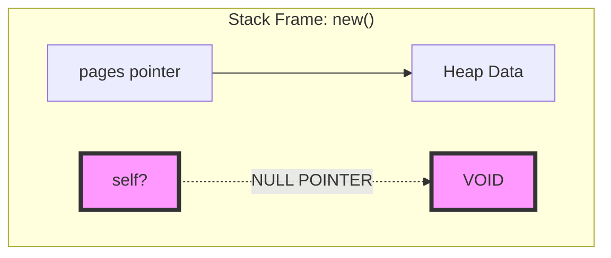
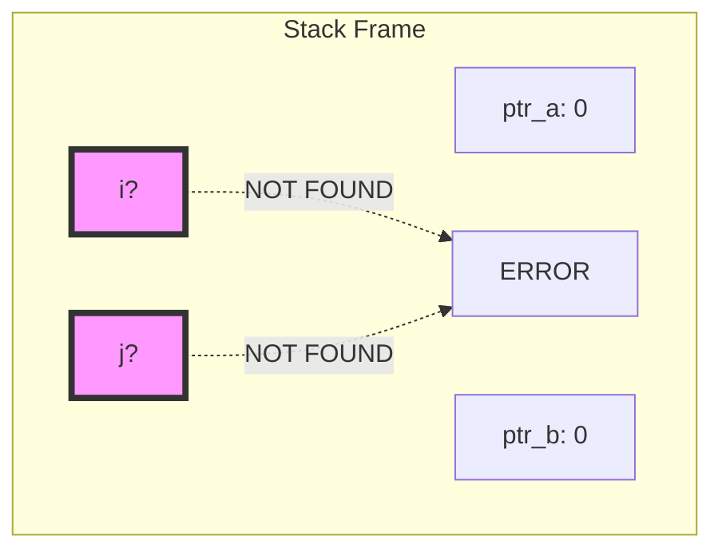

# The Inverted Index: A Step-by-Step Construction

This document illustrates the complete lifecycle of an Inverted Index, from raw text to complex optimized queries. We will build everything from scratch using concrete numbers.

## Phase 1: The Input Data (The "Vintage Camera Shop")

We start with 3 specific web pages. We assign them unique **DocIDs**.

*   **DocID: 101**
    *   **Content:** "The Leica M3 is a classic 35mm camera."
*   **DocID: 102**
    *   **Content:** "Use 35mm film. Leica lenses are sharp."
*   **DocID: 103**
    *   **Content:** "Digital cameras lack the soul of 35mm film."

---

## Phase 2: Building the Index (Ingestion)

We need to transform this text into a searchable map.

### Step 1: Tokenization (Cleaning)
We convert text to lowercase and split it into "tokens" (words).

*   **Doc 101:** `["the", "leica", "m3", "is", "a", "classic", "35mm", "camera"]`
*   **Doc 102:** `["use", "35mm", "film", "leica", "lenses", "are", "sharp"]`
*   **Doc 103:** `["digital", "cameras", "lack", "the", "soul", "of", "35mm", "film"]`

### Step 2: Inversion (Mapping Word -> DocIDs)
We iterate through every token. If a word is seen, we append the current DocID to its list.

**After Processing Doc 101:**
*   "leica" -> `[101]`
*   "35mm" -> `[101]`

**After Processing Doc 102:**
*   "leica" -> `[101, 102]` (Added 102)
*   "35mm" -> `[101, 102]` (Added 102)
*   "film" -> `[102]` (New)

**After Processing Doc 103:**
*   "35mm" -> `[101, 102, 103]`
*   "film" -> `[102, 103]`
*   "digital" -> `[103]`

### The Final Index Structure
This is the exact data structure stored in memory:

| Word | List of DocIDs (Sorted) |
| :--- | :--- |
| **"35mm"** | `[101, 102, 103]` |
| **"leica"** | `[101, 102]` |
| **"film"** | `[102, 103]` |
| **"camera"** | `[101]` |
| **"digital"**| `[103]` |

---

## Phase 3: The "Why is it Sorted?" Mystery

You asked: *"How did it become sorted? If I use an unordered map, isn't it random?"*

**The Answer:** The **Keys** (words) are random. The **Values** (lists) are sorted by **Time**.

### The "Time = Order" Principle
We process documents one by one. We assign IDs as we see them.

**Visualizing the Timeline:**

**Time T=1: We crawl Doc 101**
*   We see "leica".
*   We create a list.
*   We append `101`.
*   **State:** `{"leica": [101]}`

**Time T=2: We crawl Doc 102**
*   We see "leica".
*   We fetch the existing list `[101]`.
*   We append `102`.
*   **State:** `{"leica": [101, 102]}`
*   *Why is it sorted?* Because `102` > `101` and Time T2 > Time T1.

**Time T=3: We crawl Doc 103**
*   We see "leica"? No.
*   We see "35mm".
*   Existing list: `[101, 102]`.
*   We append `103`.
*   **State:** `{"35mm": [101, 102, 103]}`

**The "Unordered Map" Confusion:**
The `HashMap` buckets are indeed unordered.
*   Bucket 1 might hold "zebra".
*   Bucket 2 might hold "apple".
*   Bucket 3 might hold "leica".

But inside Bucket 3, the **Value** is a `Vector` (List). We only ever **append** to the end of this vector. Since we process Doc 1, then Doc 2, then Doc 3, the vector naturally grows as `[1, 2, 3]`.

**What if we processed them out of order?**
If we read Doc 103, then Doc 101, we would get `[103, 101]`.
*   **The Fix:** In that specific case, we would have to run `List.sort()` after indexing is done.
*   **The Reality:** Most crawlers assign IDs sequentially (1, 2, 3...) as they find pages, so sorting is free.

---

## Phase 4: Query Execution (The Algorithms)

### Scenario A: The 2-Word Query (Basic Intersection)
**Query:** `"leica 35mm"` (Find pages with BOTH).

1.  **Fetch Lists:**
    *   List A ("leica"): `[101, 102]`
    *   List B ("35mm"): `[101, 102, 103]`

2.  **Intersect (Two-Pointer Method):**
    *   `101` vs `101` -> **Match!** (Add to result, move both)
    *   `102` vs `102` -> **Match!** (Add to result, move both)
    *   End of List A. Stop.

**Result:** `[101, 102]`

---

### Scenario B: The 3-Word Query (Multi-Way Intersection)
**Query:** `"leica 35mm film"`

1.  **Fetch Lists:**
    *   A ("leica"): `[101, 102]`
    *   B ("35mm"): `[101, 102, 103]`
    *   C ("film"): `[102, 103]`

2.  **Step 1: Intersect A & B**
    *   Result: `[101, 102]` (From Scenario A)

3.  **Step 2: Intersect (Result) & C**
    *   Input 1: `[101, 102]`
    *   Input 2 ("film"): `[102, 103]`
    *   **Compare:**
        *   `101` vs `102` -> `101` is smaller. Skip `101`.
        *   `102` vs `102` -> **Match!**
    *   End of Input 1. Stop.

**Final Result:** `[102]` (Only Doc 102 has all 3 words).

---

## Phase 5: The 10-Word Query (Optimization at Scale)

**Query:** `"the quick brown fox jumps over the lazy dog today"`

If we use the naive method (Left-to-Right), we might start with a huge list like "the" and waste time filtering it. We need to **Fail Fast**.

### The "Sort by Frequency" Optimization

**The Rule:** Always intersect the **shortest** lists first.

**1. Inspect List Lengths:**
*   "today": 2 docs `[10, 99]`
*   "jumps": 3 docs `[5, 10, 99]`
*   "quick": 4 docs `[5, 10, 25, 99]`
*   ...
*   "the": 15 docs `[...many...]`

**2. Re-order Execution Plan:**
Do not process Left-to-Right. Process **Smallest-to-Largest**.

**3. Execution Trace:**

*   **Round 1:** Intersect "today" (2) & "jumps" (3)
    *   `[10, 99]` vs `[5, 10, 99]`
    *   Match: `10`, `99`
    *   **Survivor List:** `[10, 99]`

*   **Round 2:** Intersect Survivors & "quick" (4)
    *   `[10, 99]` vs `[5, 10, 25, 99]`
    *   Match: `10`, `99`
    *   **Survivor List:** `[10, 99]`

*   **Round 3 to 9:**
    *   We continue checking our tiny list of survivors `[10, 99]` against the larger lists.
    *   We effectively ignore 90% of the data in the large lists because we only care about `10` and `99`.

**4. Final Check:**
*   Check "the" (15 docs).
*   Is `10` in "the"? Yes.
*   Is `99` in "the"? Yes.

**Final Result:** `[10, 99]`

**Why this matters:**
By starting with "today" (2 items), we ensured our working set never exceeded 2 items. If we started with "the" (15 items), we would have done 7x more work in the first step alone.

---

## Phase 6: The Anatomy of Errors (A Post-Mortem)

This section dissects the specific errors made during implementation, visualizing *why* the compiler rejected them.

### Error 1: The "Ghost" Assignment
**Code:** `self.pages = pages.clone();` inside `fn new()`
**Why it failed:** `new` is a static factory, not a method. There is no `self` instance yet.


**The Fix:** You must *construct* the box, not try to fill a non-existent one.
`InvertedWebPages { pages: ... }`

---

### Error 2: The "Broken Chain"
**Code:** `entry(...).or_insert(Vec::new());` (Missing `.push()`)
**Why it failed:** You opened the box but didn't put anything in it. The data was lost.

```mermaid
graph LR
    A[entry("rust")] -->|Returns| B[Entry Handle]
    B -->|or_insert| C[Empty Vector []]
    C -.->|End of Line| D[DROP]
    E[Integer 'num'] -.->|Not Used| F[Lost Data]
    style F fill:#f9f,stroke:#333,stroke-width:4px
```
**The Fix:** Complete the chain.
`entry(...).or_insert(...).push(num);`

---

### Error 3: The "Blind" Function
**Code:** `fn search_word(&query: String)` (Missing `&self`)
**Why it failed:** The function had no access to the struct's data. It was locked outside.

```mermaid
graph TD
    subgraph "Struct Memory"
        A[page_map]
    end
    subgraph "Function: search_word"
        B[query: "rust"]
    end
    B -.-x|NO PATH| A
    style B fill:#f9f,stroke:#333,stroke-width:4px
```
**The Fix:** Add `&self` to give the function a key to the instance.
`fn search_word(&self, query: &str)`

---

## Phase 7: The Intersection Logic Errors

This section analyzes the errors in `finc_common_elements`.

### Error 4: The "Identity Crisis" (Undefined Variables)
**Code:** Defined `ptr_a`, `ptr_b` but used `i`, `j`.
**Why it failed:** The compiler looks for `i` and `j` in the stack frame but only finds `ptr_a` and `ptr_b`.



### Error 5: The "Infinite Echo" (Logic Trap)
**Code:** `if list_a[i] == list_b[j] { res.push(...) }` (No increment)
**Why it failed:** If values match, you push the result but *never move the pointers*. The loop repeats the same check forever.

```mermaid
graph TD
    A[Start Loop] --> B{10 == 10?}
    B -- YES --> C[Push 10]
    C --> D[Check < (False)]
    D --> E[Check > (False)]
    E --> A[Start Loop]
    style A fill:#f9f,stroke:#333,stroke-width:4px
```
**Result:** `[10, 10, 10, 10, ...]` until memory crash.

### Error 6: The "C++ Hangover" (Syntax)
**Code:** `i++`
**Why it failed:** Rust does not support the `++` operator.
**The Fix:** Use `i += 1`.

### Error 7: The "Self-Comparison" (Typo)
**Code:** `if list_a[i] > list_b[i]`
**Why it failed:** You compared index `i` of List A with index `i` of List B. But List B is tracked by `j` (or `ptr_b`).
**Risk:** If `i` is 100 and List B only has 5 items, this causes an **Index Out of Bounds** crash.
