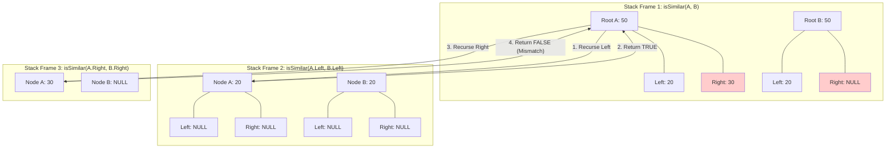
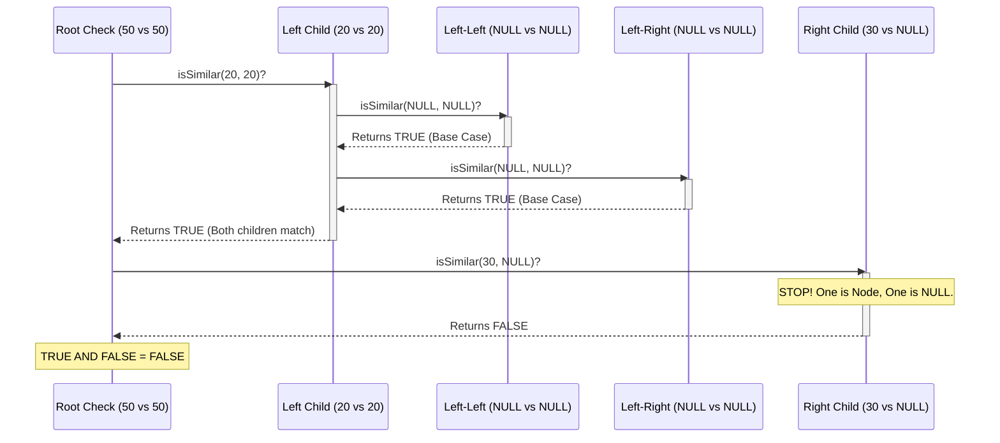

# Recursion Visuals

**Why this diagram?** This diagram represents the *call stack* in memory. You cannot "see" recursion without seeing the stack frames piling up. Frame 1 is paused while Frame 2 runs. Frame 1 only resumes when Frame 2 returns. The "Mismatch" in Frame 3 is the critical failure point.

**Why this diagram?** This sequence diagram shows the *time* dimension. It proves that we don't even look at the Right child of the Root until the ENTIRE Left subtree has been fully verified. The computer is single-minded. It dives deep, finishes the job, comes back up, and then dives down the other side.

### The Dense Logic Trace
We begin execution at the root addresses 0xA1 (Tree A) and 0xA2 (Tree B). The CPU enters `isSimilar(0xA1, 0xA2)`. **Check 1:** Are both 0xA1 and 0xA2 NULL? No. **Check 2:** Is one NULL and the other not? No. **Action:** We must check the structure underneath. The CPU pauses this function call (pushes it to the stack) and jumps to a new function call: `isSimilar(0xA1->left, 0xA2->left)`, which translates to `isSimilar(0xB1, 0xB2)`. Inside this new call: **Check 1:** Are both 0xB1 and 0xB2 NULL? No. **Check 2:** Is one NULL? No. **Action:** Dive deeper. The CPU pauses again and calls `isSimilar(0xB1->left, 0xB2->left)`, which is `isSimilar(NULL, NULL)`. **Check 1:** Are both NULL? **YES.** This is our first success. The function returns `TRUE` immediately. The CPU pops the stack and returns to the previous context (`0xB1` vs `0xB2`). It now holds a `TRUE` for the left side. It proceeds to the right side: `isSimilar(0xB1->right, 0xB2->right)`, which is `isSimilar(NULL, NULL)`. **Check 1:** Are both NULL? **YES.** Returns `TRUE`. Back in the `0xB1` vs `0xB2` context, we calculate `TRUE (Left) AND TRUE (Right)`. The result is `TRUE`. This entire subtree matches. We return `TRUE` up to the original root call (`0xA1` vs `0xA2`). The root now knows its left child is valid. It proceeds to the right child: `isSimilar(0xA1->right, 0xA2->right)`, which translates to `isSimilar(0xC1, NULL)`. **Check 1:** Are both NULL? No. **Check 2:** Is one NULL? **YES.** `0xC1` is a valid address, but the second argument is `0x0` (NULL). This is a structural XOR violation. The function immediately returns `FALSE`. Back at the root (`0xA1` vs `0xA2`), we perform the final calculation: `TRUE (Left Result) AND FALSE (Right Result)`. The result is `FALSE`. The trees are not similar.
