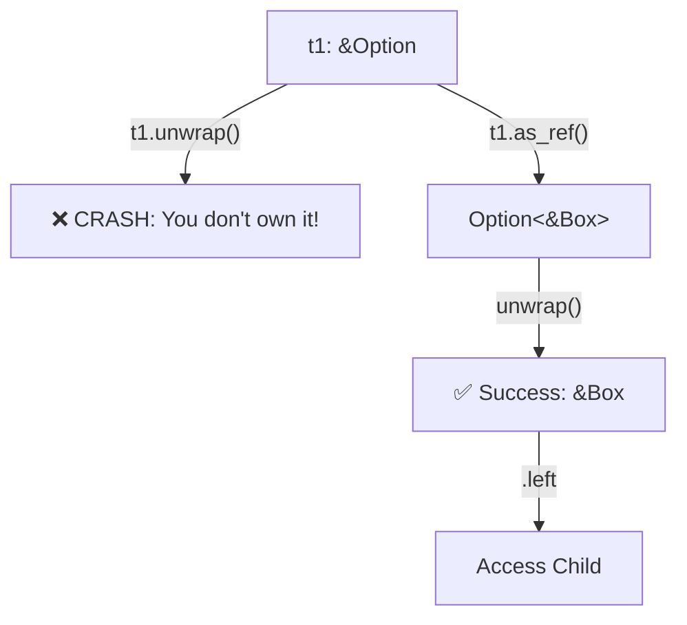

# The "Gift Box" Analogy: `as_ref()` vs `unwrap()`

You have a **Gift Box** (`Option`) sitting on a table.
*   **`Some(Data)`**: The box has a toy inside.
*   **`None`**: The box is empty.

## The Problem: `t1` is a Reference (`&Option`)
You are **looking** at the box. You do not **own** the box. You cannot take the box home.

### 1. Why `unwrap()` fails directly
If you try `t1.unwrap()`, you are trying to **destroy** the box to get the toy.
*   **Rust Police:** "Hey! That box belongs to someone else (the caller). You only have a reference (`&`). You cannot destroy it!"
*   **Result:** Compiler Error (Cannot move out of borrowed content).

### 2. The Magic of `as_ref()`
`as_ref()` says: "I don't want to destroy the box. I just want to **open the lid** and look at the toy inside."
*   **Transformation:** Converts `&Option<Box>` (Reference to a Box) -> `Option<&Box>` (A new temporary Option containing a *Reference* to the inner toy).

### 3. Now `unwrap()` is safe
Now you have a *temporary* handle (the open lid).
*   `unwrap()` on this temporary handle says: "I assert there is a toy here. Let me see it."
*   Since we already checked `is_none()` in the lines above, we *know* 100% the toy is there.
*   **Result:** You get `&Box<TreeNode>` (A reference to the node).

## Visual Flow



## The "Pro" Way: `match` (No Unwrap)

Instead of checking `if` and then `unwrap`, we can do it all at once with `match`. This is like a sorting machine.

```rust
match (t1, t2) {
    (None, None) => true,             // Both empty? Good.
    (Some(n1), Some(n2)) => {         // Both full? Open them automatically!
        // n1 and n2 are now accessible here safely.
        is_similar(&n1.left, &n2.left) && is_similar(&n1.right, &n2.right)
    },
    _ => false,                       // Mismatch (One empty, one full)
}
```

## Why does `unwrap()` exist? (The Panic Button)

If `match` is so safe, why do we ever use `unwrap()`?

1.  **Certainty:** Sometimes you *know* the box is full.
    *   Example: You just put a toy in the box 1 second ago.
    *   Using `match` feels like overkill. `unwrap()` is a shortcut: "Just give it to me, I know it's there."
2.  **Prototypes:** When you are lazy and just want to see if the code works.
    *   "If it's empty, just crash the program, I don't care right now."

**BUT:** In production code (like this problem), `unwrap()` is dangerous. If you are wrong, the program crashes. That's why `match` is better here.
