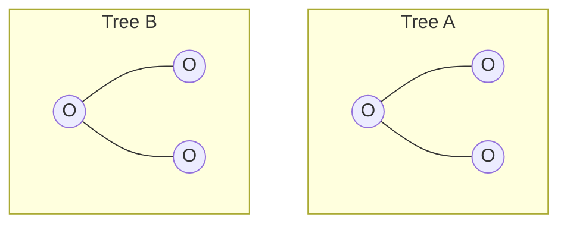
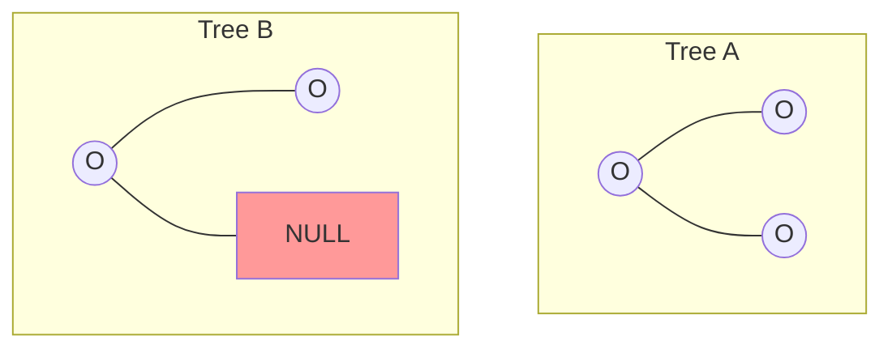
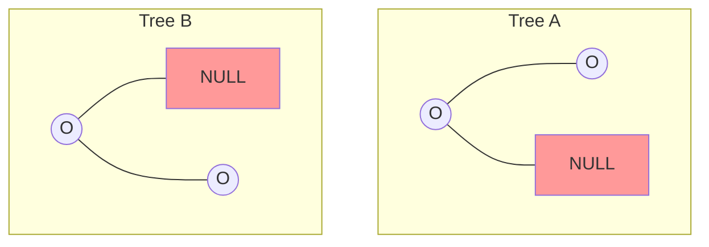
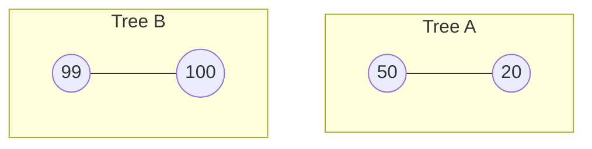
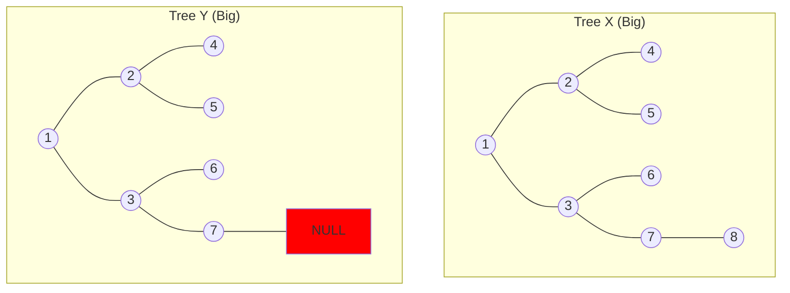

# What is Tree Similarity?

"Similarity" in this problem means **Topology** (Shape). It asks: "Do these trees occupy the exact same space?"

It does **NOT** care about the numbers inside the nodes (unless the problem explicitly asks for "Equivalence", but your text said "Similarity").

## Visual Examples

### Case 1: PERFECT MATCH (Similar)
Both trees have a Root. Both have a Left Child. Both have a Right Child.

*   **Verdict:** **SIMILAR**.
*   **Why:** Every node in A has a corresponding partner in B. No one is lonely.

### Case 2: THE "EXTRA LIMB" (Not Similar)
Tree A has a Right child. Tree B does not.

*   **Verdict:** **NOT SIMILAR**.
*   **Why:** Tree A extends to the right. Tree B stops. They have different shapes.

### Case 3: THE "MIRROR" (Not Similar)
Tree A leans Left. Tree B leans Right.

*   **Verdict:** **NOT SIMILAR**.
*   **Why:** A left arm is not the same as a right arm. In binary trees, Left and Right are distinct positions.

### Case 4: VALUES DON'T MATTER (Structurally Similar)
The shape is identical. The numbers are different.

*   **Verdict:** **SIMILAR** (Structurally).
*   **Why:** If we only check `if (node != NULL)`, both trees pass exactly the same checks. They have the same skeleton.

## Complex Example: The Deep Mismatch

Here are two bigger trees. They look almost identical, but look closely at the bottom right.

### The Trace
1.  **Level 1:** Roots match.
2.  **Level 2:** Children (2,3) match.
3.  **Level 3:** Grandchildren (4,5,6,7) match.
4.  **Level 4 (The Trap):**
    *   Tree X has node `8` attached to `7`.
    *   Tree Y has `NULL` attached to `7`.
    *   **MISMATCH FOUND.**

**Result:** The entire comparison returns `FALSE`. It doesn't matter that 99% of the tree matches. One missing finger makes the skeletons different.

## The "Handshake" Analogy

Imagine Tree A and Tree B are two people standing in the dark. You can't see them, you can only feel them.
1.  You grab the Root of A and Root of B. Both exist? Good.
2.  You move your left hand down A's left arm, and your right hand down B's left arm.
    *   If you feel an arm on BOTH, good.
    *   If you feel air on BOTH, good.
    *   If you feel an arm on one and air on the other -> **STOP. DIFFERENT.**
3.  You repeat for the Right arms.

**Similarity = Identical Skeleton.**
